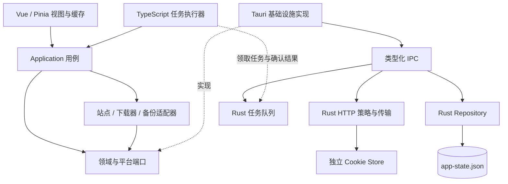

# PT-depiler 架构优化方案

## 1. 方案基线

| 项目     | 内容                                                                                                   |
| -------- | ------------------------------------------------------------------------------------------------------ |
| 状态     | 实施中；各任务以第 10 节验收记录为准                                                                   |
| 日期     | 2026-09-30                                                                                             |
| 代码基线 | `07a7962`，版本 `0.0.6`                                                                                |
| 适用范围 | Vue/Pinia、TypeScript 用例与外部服务适配、Tauri IPC、Rust 网络与本地数据服务                           |
| 实施方式 | 按数据域和业务调用链渐进迁移，每个变更均可独立验证                                                     |
| 关联文档 | [原架构设计](./2026-09-12-桌面端架构优化设计.md)、[原任务拆解](./2026-09-12-桌面端架构优化任务拆解.md) |

本方案以当前实现为依据，补充原设计中的执行缺口。发生冲突时，本方案用于本轮优化的设计与验收；原文档保留历史背景，已有任务的完成状态应依据实际验收结果重新核对。**2026-10-08 设计变更：下文第 3～9 节采用统一 JSON 文件方案；第 10 节既有 SQLite 实施记录仅为历史证据，不再是目标架构或当前完成状态。当前任务口径以[开发计划](./2026-10-02-架构优化开发计划.md)为准。**

明确约束：下载器密码、Token 和备份密钥不进入系统 Keyring，继续随对应实体保存在应用本地 JSON 文件；本轮不引入凭据静态加密或 `secretRef` 存储层。原设计中的 Keyring 迁移要求不适用于本方案。

目标是让持久化数据、平台授权和任务状态拥有明确的管理者，使搜索、下载和备份用例能够通过可替换的依赖执行，并保证升级、重启和恢复失败后数据仍可解释、可恢复。

保留 Vue 3、TypeScript、Tauri 2 与现有站点/下载器适配体系。目录拆分随职责迁移实施，站点规则和第三方协议继续复用现有实现。本轮不包含产品界面重设计、移动端或新增下载器功能。

## 2. 当前问题与证据

| 问题                           | 当前代码证据                                                                          | 影响                                             | 优先级 |
| ------------------------------ | ------------------------------------------------------------------------------------- | ------------------------------------------------ | ------ |
| 敏感配置缺少统一访问与导出规则 | 下载器密码随 metadata 保存；备份密钥随 config 保存；多个模块直接读取配置              | 日志、任务和备份中的敏感字段处理需要统一         | P1     |
| HTTP 授权依赖请求方声明        | `tauriAdapter.ts` 从请求 URL 生成 endpoint；`http.rs` 的 `ptd_fetch()` 按请求注册资源 | 校验范围缺少可信来源，重定向没有逐跳通过资源策略 | P1     |
| 持久化数据有多个写入者         | Pinia、`alarms.ts`、`backup.ts`、站点 `adapter.ts` 都能整体写回 metadata              | 并发更新可能相互覆盖，UI 缓存可能过时            | P1     |
| 备份恢复跨存储缺少事务日志     | JSON 键已批量原子写入；下载历史在 IndexedDB 事务中更新，Cookie 在独立存储中批量提交   | 跨存储失败后仍可能留下部分恢复状态               | P1     |
| 调度任务缺少持久化状态         | `scheduler.rs` 发送事件；`alarms.ts` 将重下载参数放入内存 Map                         | 重启后丢失任务，发送成功无法证明业务完成         | P1     |
| 应用层端口未控制真实调用链     | 搜索 `siteFactory.create()` 忽略 context；站点适配器依赖消息与存储入口                | 测试替身与生产装配存在差距                       | P2     |
| 初始化与释放未形成完整生命周期 | 服务通过导入副作用注册，存储修复不等待，调度监听未集中取消                            | 半初始化状态、重复监听和资源泄漏难以定位         | P2     |
| 协议与错误契约仍可绕开         | 总线泛型相交字符串索引类型；注册表允许 replace；多数 Rust IPC 返回字符串错误          | 类型约束、注册完整性和诊断语义不统一             | P2     |
| 平台模块与验证仍需收口         | `http.rs` 混合传输、登录、Cookie、IPC 与测试；架构检查依赖正则与例外                  | 修改影响面较大，静态检查难以识别真实边界         | P2     |

当前已有显式启动入口、协议完整性检查、资源 Axios 实例、HTTP 策略、CSP 和窗口 capability，这些实现作为迁移基础保留，验收重点转为实际调用链是否遵守边界。已有 Keyring 命令不作为本轮凭据存储方案的依赖；后续收口时核实调用情况，并移除未使用的命令与依赖。

### 2.1 Cookie 策略与文档差异

当前 `state.rs` 使用 `cookies.v2.json` 保存明文 Cookie，`plaintextCookiePersistence.static.test.ts` 明确固定这一行为。原设计和 README 中的加密描述已经不符合代码。

本轮保留当前 Cookie 明文存储策略，将其标识为本地敏感数据，采用操作系统用户访问限制，避免进入普通日志和默认备份。下载器密码、Token 和备份密钥同样由应用本地配置管理，不使用系统凭据存储。文档需准确区分本地存储策略与备份文件可选加密。

## 3. 目标架构



图中虚线表示接口实现或任务协作。TypeScript 用例通过装配时注入的端口获得平台能力；Rust 持有持久化数据和授权状态。

### 3.1 职责与依赖规则

| 层级           | 职责                                               | 依赖约束                                                       |
| -------------- | -------------------------------------------------- | -------------------------------------------------------------- |
| Presentation   | 展示、交互、视图状态、资源缓存                     | 调用应用接口；业务数据变更通过用例完成                         |
| Application    | 搜索、下载、备份、账号和任务用例                   | 依赖领域类型、适配器接口和平台端口；不依赖 Vue、Pinia 或 Tauri |
| Integrations   | 外部协议、站点规则和结果归一化                     | 通过注入的 HTTP、设置、时钟、日志等端口执行；不导入 `entries`  |
| Infrastructure | Tauri 端口实现、IPC 转换和错误映射                 | 依赖端口与 IPC 契约；由启动装配入口创建                        |
| Rust Services  | 资源授权、Repository、凭据、Cookie、任务和系统能力 | 所有输入在服务边界校验；内部服务可脱离 WebView 测试            |

Pinia 分为视图状态和资源缓存两类。筛选、展开状态和弹窗可直接修改；站点、下载器、历史和任务等持久化数据由用例提交变更，再刷新缓存。确需保存的 UI 偏好也通过设置 Repository 写入。

建议随迁移形成以下目录：

```text
src/
  app/                  # 装配、启动、释放、应用上下文
  application/          # 搜索、下载、备份、账号、任务用例
  domain/               # 业务类型与端口
  infrastructure/tauri/ # 平台端口实现
  contracts/            # 生成的 IPC 类型与版本契约
  entries/options/      # Vue、组件、视图状态与资源缓存
  packages/             # 现有站点及外部服务适配器
  testing/              # 内存实现、测试夹具与装配工具

src-tauri/src/
  ipc/                  # 命令入口与 DTO
  http/                 # 策略、重定向、reqwest/curl 传输
  auth/                 # Cookie Store 与登录窗口
  persistence/          # JSON 原子提交、旧源导入、业务 Repository
  scheduler/            # 队列、任务状态、租约与恢复
```

现有内存端口实现逐步移入测试目录。拆分 `http.rs` 时保留已有测试，并使两种传输复用同一授权与重定向策略。

## 4. 关键优化设计

### 4.1 统一持久化所有权

第一步收敛写入接口：将整份 metadata 的写回替换为业务操作，如 `updateSiteRuntimeSettings`、`saveDownloader`、`updateBackupTimestamp`。所有持久写入由 Rust 的同一个 Repository 串行处理，调用方不能写回 Pinia 快照或绕过 Repository 编辑文件。

统一活动文件采用应用数据目录中的 `app-state.json`。选用新文件名，使现有 `storage.json` 能作为可识别的旧源，避免导入时覆写源文件。文件顶层包含 `formatVersion`、全局 `revision`、逐域版本、`lastCommitOperationId`、`nextDownloadId`、`config`、`metadata`、`userInfo`、`searchResultSnapshot`、`keepUploadTask`、`downloadHistory`、`tasks`、迁移标记和恢复日志。历史和任务记录按 ID 存储；其字段仍按实体契约校验，不把凭据复制到任务 payload。备份文件有独立的格式版本。Cookie 保持现有独立文件，下载的种子文件和临时 UI 状态不属于配置文件。

Repository 持有进程内写锁，另在应用数据目录持有稳定锁文件的操作系统独占锁；第二个应用进程无法获得锁时拒绝启动业务写入。同进程多窗口共享 Repository。每次命令基于已提交快照校验 `expectedRevision` 或实体旧值、计算新状态，在同目录创建仅当前用户可读的临时文件，写入并同步文件后原子替换 `app-state.json`，再同步目录。只有完成提交才发布新 revision 和失效通知。替换后目录同步失败属于提交结果不确定：阻断后续写入，重读磁盘并核对操作 ID 与 revision，不能直接报告为未提交并重试。启动拒绝损坏或高版本文件，不得用默认空状态覆盖。

| 数据域                                 | 目标存储               | 操作边界                             |
| -------------------------------------- | ---------------------- | ------------------------------------ |
| config、站点与服务 metadata、凭据      | `app-state.json`       | 实体条件更新；配置与凭据同次提交     |
| 下载历史、用户历史、搜索快照、辅种任务 | `app-state.json`       | 稳定 ID、条件比较和跨域一次快照提交  |
| 调度任务、幂等键、租约与恢复日志       | `app-state.json`       | 领取、续租、回执和恢复阶段均持久提交 |
| Cookie                                 | 独立 `cookies.v2.json` | 仍需跨文件恢复补偿                   |
| 临时筛选与界面状态                     | Pinia                  | 可丢弃、可重建                       |

配置更新携带 `expectedRevision`，成功后返回新 revision；冲突返回稳定错误码，由 UI 重读并提示合并。批量历史导入、快照元数据与正文更新、任务领取均在一次完整文件提交中变更。JSON 提交成本随文件大小增长，AP-07 必须实测历史数量、文件大小、写入延迟和内存峰值，并确定可支持上限；超出上限时明确拒绝写入和给出诊断，不得静默截断历史。

资源缓存采用“提交后失效通知 + revision 检查 + 主动刷新”。事件可以丢失，因此重新进入页面或窗口恢复时必须能够从 Repository 重建正确状态。

### 4.2 本地凭据配置管理

下载器密码、Token 和备份密钥保留为对应实体或设置中的本地字段，与普通配置一起通过 Repository 保存、读取和删除。本轮不要求迁入系统 Keyring，不新增 `secretRef`，也不以另一套外部密钥存储替代 Keyring。

配置服务维护敏感字段清单，覆盖下载器密码、服务 Token、备份加密密钥及第三方服务认证字段。旧 JSON 到统一 JSON 的迁移保留这些字段的值和原有语义；迁移失败保留源数据，提交成功且通过重启校验后按迁移策略清理旧数据和临时副本。

保存凭据与普通实体字段使用同一提交边界。删除实体时在同一操作中删除其本地凭据字段；不再引入跨 Keyring 的提交、补偿或清理队列。

设置界面可以按需读取和修改已有凭据，密码与 Token 输入默认遮挡，保持原有编辑语义。列表、普通资源缓存和状态查询使用裁剪后的 DTO；认证执行时按资源 ID 读取当前配置，避免在任务 payload、实例缓存键和日志中复制敏感值。

备份设置明确区分普通配置与敏感字段。默认导出普通配置；用户选择包含凭据时，导出记录其选择并沿用可选备份加密机制。备份密钥默认不包含在导出内容中，解密备份需要外部提供对应密钥。第三方 CookieCloud 等特定协议单独维护其兼容处理。

统一配置文件、锁文件和 Cookie 文件采用当前操作系统用户访问限制。运行、保存和认证流程不依赖系统 Keyring 的可用性。

### 4.3 可信 HTTP 资源与统一传输策略

资源表由 Rust 根据已提交的站点和服务配置建立。内置公共 API 由应用定义声明 endpoint，涉及用户授权的额外地址记录在资源配置中。

普通请求携带 `resourceId`、相对路径、方法、业务请求头和请求体。绝对下载 URL、登录跳转和多域 API 在适配边界归入明确的允许 origin 集合。前端不能通过每次请求覆盖资源 endpoint 或扩大 resource kind。

策略需要覆盖：

- 校验 HTTP(S) 协议、请求方法、资源状态、路径和允许 origin。
- 根据资源类型校验实际连接地址；站点和公共 API 默认拒绝私网，已登记下载器/备份服务按配置允许私网。
- 每次重定向重新校验目标、方法和认证信息传播，禁止未经允许的认证跨域转发。
- DNS 检查与实际连接使用一致的地址决策；系统代理场景明确代理解析与策略保证，无法保证的访问返回可诊断结果。
- reqwest 与 macOS curl 兼容路径执行同一资源策略；curl 参数、连接和重定向行为保持可验证。
- 过滤平台保留头，认证信息由对应资源的认证配置生成。
- 对响应体施加可配置上限；大文件使用流式文件下载与进度事件，减少完整 body 和 base64 的多份内存副本。

初始建议普通响应上限为 32 MiB，以兼容夹具和真实服务验证后调整。不能仅信任 `Content-Length`，读取过程中同样执行上限检查。重试保留现有幂等判断，并给请求设置总耗时上限。

### 4.4 持久化任务与执行器

Rust 管理任务真相，TypeScript 执行器复用现有站点解析和服务适配用例。首版执行器随业务 WebView 存活，应用退出时暂停任务；重新启动后恢复。窗口关闭后的常驻执行属于后续产品行为，需独立实现托盘或受控工作上下文，不能仅凭 Rust 队列就宣称支持。

任务至少包含：`id`、`kind`、`payloadVersion`、`payload`、`resourceId`、`state`、`runAt`、`attempt`、`maxAttempts`、`leaseOwner`、`leaseExpiresAt`、`idempotencyKey`、`lastError` 和时间戳。payload 保存资源 ID 和恢复所需参数，不复制凭据值；执行时从对应本地配置读取当前认证信息。

```text
queued -> scheduled -> running -> succeeded
                         |
                         +-> retry_wait -> scheduled
                         +-> failed
                         +-> uncertain
queued / scheduled / retry_wait -> cancelled
```

执行器在写锁内查找到期任务，检查幂等键、资源并发上限和已有租约，将领取结果与租约写入统一文件且确认提交成功后才开始外部操作。续租、回执和取消也各自持久提交；提交失败不允许继续领取。事件仅用于唤醒，定期扫描保证事件丢失后仍可执行。幂等键映射与任务记录同次更新，避免重复创建周期任务。

执行语义为至少一次。下载等外部副作用优先使用服务提供的幂等能力；缺少该能力时，通过 infoHash、远端任务查询等方式核对结果。发生“远端操作成功、确认结果未提交”的中断时，进入 `uncertain` 并执行核对，避免直接重复推送。取消 running 任务属于尽力中止，状态需区分已请求取消和已确认取消。

### 4.5 一致备份与分阶段恢复

备份格式 v2 包含 `formatVersion`、独立的数据格式版本、创建时间、数据域列表、每个文件的大小与校验值，以及必要的加密参数。版本使用独立字段，不以应用版本字符串替代数据兼容判断。

配置、历史和任务从同一个已提交 JSON 快照导出，用户选择包含凭据时，凭据字段与对应实体取自该快照。Cookie 属于独立存储，导出期间记录其 revision 或时间点并校验是否变化；变化时重试或明确记录一致性范围。普通备份默认排除凭据和 Cookie，备份密钥默认排除。选择包含凭据的跨设备备份恢复后，将值保存到目标设备的本地配置中。

需要加密的应用备份使用成熟的认证加密实现和口令派生库，例如 AES-GCM 配合 Argon2id；格式记录参数、salt、nonce 和认证信息。具体参数以目标平台测试为依据，损坏或认证失败时禁止修改活动数据。第三方服务要求的加密格式在对应适配器内保留。

恢复流程：

1. 校验格式、版本、校验值、大小限制、数据结构和引用关系。
2. 将数据导入暂存区，建立恢复日志和恢复前快照。
3. 暂停相关任务和写操作，准备实体配置与可选的 Cookie 替换文件。
4. 原子替换统一 JSON，将业务变更和恢复日志阶段同次提交，标记为待完成 Cookie 提交。
5. 按恢复选择原子替换 Cookie 文件，更新日志为完成。
6. 刷新 UI 缓存并恢复任务；失败时依据日志继续提交或执行补偿。

实体配置、历史、任务及包含在恢复内容中的凭据字段在统一 JSON 的同一次替换中提交；未包含凭据的备份恢复已有实体时保留其现有敏感字段，新实体缺少凭据时标记为待配置。统一 JSON 与 Cookie 文件无法组成单一原子提交，恢复日志必须明确记录各阶段的落盘状态、补偿资料及幂等操作。恢复日志包含在统一 JSON 内，不另开普通业务状态文件；显式含 Cookie 的恢复前副本仍需独立敏感临时文件。应用启动时先处理未完成恢复，再开放业务写入。下载历史禁止在校验与暂存完成前清空。

### 4.6 完整启动与释放

`bootstrapApp()` 的职责收敛为显式装配与生命周期管理，顺序如下：

```text
创建基础设施
  -> 校验存储版本并处理未完成恢复
  -> 执行本地配置与历史数据迁移
  -> 从持久化配置建立 HTTP 资源表
  -> 创建用例和适配器
  -> 注册并冻结协议
  -> 安装事件监听
  -> 初始化资源缓存
  -> 启动执行器并恢复任务
  -> 挂载业务 UI
```

每个步骤返回结果或清理函数。关键迁移、配置恢复和协议校验失败时展示诊断界面；可选图标缓存等失败进入明确的降级状态。禁止把持久化读取失败解释为没有数据后继续写入默认值。

`AppContext.dispose()` 返回 Promise，按逆序取消监听、停止领取任务、中止或交还执行租约、刷新必要写入并卸载 UI。热更新、窗口重建和失败启动均经过同一释放流程。

### 4.7 契约、错误与日志

保留现有消息兼容入口，内部逐步转发到封闭的应用接口。移除总线泛型中的开放字符串索引，启动后禁止 register/replace；测试可创建独立的未冻结实例。Command/Query 的分离以副作用和调用规则为依据，避免仅增加同名包装类。

IPC DTO 建议以 Rust 类型为源，使用兼容 Tauri 2 的类型生成工具生成 TypeScript，并在 CI 校验生成结果。应用内部 DTO 可以独立定义，但映射必须集中测试。类型生成不替代运行时输入校验。

统一错误返回 `code`、可展示的 `message`、`operationId`、`resourceId`、`taskId` 及必要的重试提示，覆盖认证、策略拒绝、版本冲突、存储失败、取消和能力不支持等情况。内部错误详情进入经过脱敏的诊断渠道，业务层不通过解析字符串判断错误。

日志统一经过结构化入口，覆盖对象字段、URL、字符串错误及嵌套 cause 的脱敏。记录请求关联信息、任务状态变化和迁移阶段；避免记录完整配置、种子认证 URL、请求体或原始第三方错误。生产诊断采用限量轮转文件，UI 只展示必要摘要。

## 5. 分阶段实施计划

P1 表示数据保护、可靠性基础和前置边界；P2 表示实际用例迁移与结构收口。S/M/L 只表示相对规模，不作为工期承诺。任务当前状态见第 10 节；关联旧 DT 任务不意味着重置原历史记录。

### 5.1 任务与依赖

| ID    | 优先级 | 任务及交付物                                                 | 前置任务            | 规模 | 关联旧任务                          |
| ----- | ------ | ------------------------------------------------------------ | ------------------- | ---- | ----------------------------------- |
| AO-01 | P1     | 记录存储、退出行为与恢复策略；对齐文档；建立迁移夹具         | 无                  | S    | DT-005、DT-028                      |
| AO-02 | P1     | 统一错误与 IPC 类型生成，冻结应用协议                        | AO-01               | M    | DT-007、DT-009                      |
| AO-03 | P1     | 建立业务写入入口、串行与原子提交，消除整份 metadata 并发写回 | AO-02               | M    | DT-012、DT-020                      |
| AO-04 | P1     | 完整异步启动、失败释放和监听取消                             | AO-02               | M    | DT-008                              |
| AO-05 | P1     | 可信资源注册、DNS/重定向策略及响应上限                       | AO-03、AO-04        | L    | DT-014、DT-015、DT-016              |
| AO-06 | P1     | 统一本地敏感字段保存、读取、删除与备份选择规则               | AO-03、AO-04        | M    | DT-018；替代 DT-013 的 Keyring 方向 |
| AO-07 | P1     | 统一 JSON 格式、原子 Repository 与旧源迁移                   | AO-03、AO-04        | L    | DT-017、DT-018                      |
| AO-08 | P1     | 历史/快照/辅种迁移，Pinia 资源缓存收口                       | AO-07               | L    | DT-019、DT-020                      |
| AO-09 | P1     | 持久化任务、租约、幂等核对与周期任务迁移                     | AO-04、AO-07        | L    | DT-021、DT-022                      |
| AO-10 | P1     | 备份 v2、旧备份导入、恢复日志与失败补偿                      | AO-06、AO-08、AO-09 | L    | DT-023、DT-024                      |
| AO-11 | P2     | 搜索真实依赖注入与生产装配集成测试                           | AO-04、AO-05、AO-07 | M    | DT-010、DT-012、DT-026              |
| AO-12 | P2     | 下载/备份/账号依赖注入，Rust 按职责拆分                      | AO-09、AO-10、AO-11 | L    | DT-011、DT-025、DT-026              |
| AO-13 | P2     | AST 边界检查、macOS CI、服务冒烟与恢复演练                   | AO-12               | L    | DT-006、DT-027、DT-028              |

跨平台构建和失败测试从第一批开始随变更运行；AO-13 汇总完整发布门禁。

### 5.2 第一批：补齐可信边界

实施 AO-01 至 AO-06。完成标准：

- 所有业务写入经过统一入口；两个并发字段更新不会相互覆盖。
- 启动等待必要数据恢复，失败后无残留监听和执行器。
- HTTP 资源来自已提交配置，重新注册和重定向不能扩大权限。
- 密码、Token 和备份密钥通过应用本地配置保存、读取和删除，不调用系统 Keyring。
- 敏感字段不进入普通日志、列表 DTO 或任务 payload；备份是否包含凭据具有明确选择规则。

### 5.3 第二批：统一数据与恢复能力

实施 AO-07 至 AO-10。完成标准：

- 持久化业务数据切换为 Repository，旧存储退出活动写入。
- Pinia 可从 Repository 重建；缓存失效事件丢失后仍可恢复正确状态。
- 重启、执行器重建和租约过期后任务可恢复，外部结果不确定时先核对。
- 备份恢复任一阶段失败或进程中断后，都可根据恢复日志继续或回滚。
- 更高版本的统一 JSON 和不支持的备份格式不会被当前版本覆盖。

### 5.4 第三批：迁移调用链并删除兼容层

实施 AO-11 至 AO-13。完成标准：

- 搜索、下载、备份和账号用例均通过实际注入的端口执行。
- 站点和服务包不反向导入 `entries`，使用测试替身无需加载 Vue/Tauri。
- 导入副作用注册、整体存储消息写入、旧调度事件驱动和失效例外已删除。
- 跨平台构建、数据迁移、恢复演练和真实服务冒烟均有可复核结果。

## 6. 数据迁移、兼容与回滚

### 6.1 存储版本与导入流程

统一 JSON 在文件顶层保存独立 `formatVersion`，逐域保存导入来源版本和完成标记；旧 JSON、IndexedDB 与备份分别识别源版本。迁移只接受明确支持的版本路径，未知版本拒绝写入。每步记录来源、目标、状态及结果摘要，过程可重入。目标文件名与旧 `storage.json` 分开，避免在校验前覆盖旧源。存在有效的 `app-state.json` 时它是权威值；否则仅导入旧 `storage.json`。若旧 `storage.sqlite3` 存在，拒绝首次导入并保留原文件，避免读取过时的 JSON 镜像。

IndexedDB 导入由可信 TypeScript 桥读取旧数据，桥报告版本、总量和记录。Rust 在内存中构建候选快照，校验数量、唯一 ID、必要字段、引用关系和容量，再一次原子提交候选状态及导入完成标记。已标记迁移完成域的缺失记录仍是权威空值，不从更老的 JSON 镜像复活。持久任务须保留幂等键、租约代次和不确定状态，不能把未确认的远端操作重建为新任务。不能仅在 Rust 中假定 WebView 数据已经成功导出。

单个数据域迁移遵循：

```text
锁定相关写操作
  -> 导出并校验源数据
  -> 校验并保留本地敏感配置字段
  -> 构建并校验候选 JSON 快照
  -> 校验数量、关系和代表性内容
  -> 一次原子替换目标文件及迁移标记
  -> 恢复写入
  -> 按策略清理旧数据
```

每个数据域切换后只从其新权威源读取；AP-06 根记录切换到统一 JSON 后，下载历史在 AP-07 完成前仍由 IndexedDB 承载，任务在 AP-09 完成前仍按现有机制运行。AP-07 与 AP-09 分别切换后，配置、历史和任务的活动写入才全部归于统一 JSON。旧读取接口随后仅在受控导入器内使用，旧数据暂存以便失败重试，不做同域活动双写。迁移后的空历史和空任务带有完成标记，重启不再从旧源复活。下载历史导入期间阻断读写并使用同一 Repository 锁；真实双窗口和重启演练必须验证该边界。

### 6.2 回滚边界

- 活动存储切换前失败：放弃暂存数据，保留原数据，清理本次迁移的临时文件。
- 切换后出现应用缺陷：优先修复或使用理解新 JSON 格式的兼容版本；旧二进制可能仍写旧文件，回滚前必须停止进程、保全当前统一文件并执行受控导出，禁止把旧源重新当作活动数据。
- 恢复到迁移前状态：暂停任务，将当前数据另行导出后，通过受控恢复工具还原归档及其中的本地配置字段。
- 配置迁移与回滚保持密码、Token 和备份密钥的值及编辑语义，不新增系统凭据存储依赖。
- 旧配置、IndexedDB、临时文件和归档清理发生在导入提交、重启核对及备份验证完成之后；提交统一 JSON 不等于旧源与 Cookie 清理完成。旧 SQLite 文件不由本流程清理。

## 7. 验证与发布门禁

本节下列旧测试计数是制定原 SQLite 方案时的历史基线，不是统一 JSON 目标的验收结果。统一 JSON 的验证以开发计划 AP-06～AP-21 的新判据为准；本次文档变更不声称运行代码已切换。

| 验证域     | 必须覆盖的场景                                     | 判断标准                                                 |
| ---------- | -------------------------------------------------- | -------------------------------------------------------- |
| 真实装配   | 搜索/下载用例接入替身端口，保留生产工厂            | 请求与设置访问实际经过所注入端口                         |
| 并发与缓存 | UI 保存配置同时后台更新字段，遗漏缓存事件          | 更新均保留，revision 冲突可见，缓存可重建                |
| 凭据       | 本地配置保存失败、实体删除、迁移中断、备份字段选择 | 不调用 Keyring，旧值不丢失，敏感字段不进入日志和默认导出 |
| HTTP       | 资源变更、跨域重定向、DNS/代理、超限响应、两种传输 | 策略一致，错误可解释，认证信息不越界                     |
| 数据迁移   | 旧版本、缺失字段、重复 ID、分批中断、未知高版本    | 校验失败不覆盖活动数据，重入结果一致                     |
| 任务       | 重启、租约过期、事件丢失、重复领取、远端成功后中断 | 任务可恢复，外部副作用可核对，失败有记录                 |
| 备份恢复   | 每个阶段注入故障及进程终止，旧格式导入             | 无无法解释的部分状态，启动可完成恢复或补偿               |
| 生命周期   | 初始化失败、热更新、窗口重建与正常退出             | 监听仅注册一次，dispose 释放已创建资源                   |
| 发布兼容   | Windows/macOS/Linux 编译与相关服务冒烟             | 平台差异有明确范围和记录                                 |

功能变更执行相关单元与集成测试；进入发布阶段执行现有 `pnpm verify:desktop`，并在对应 CI runner 调整平台打包目标。当前 bundle 仅配置 `app/dmg`，不能据此宣称 Windows/Linux 安装包已经验证。

诊断应提供迁移进度、任务积压、最早任务延迟、恢复日志状态和缓存 revision。指标使用数量、状态与关联 ID，避免包含敏感 payload。

## 8. 主要取舍与风险

| 项目                 | 本轮建议                                             | 控制措施                                             |
| -------------------- | ---------------------------------------------------- | ---------------------------------------------------- |
| 统一 JSON 规模       | 一个活动文件保存配置、历史和任务                     | AP-07 实测容量、写入延迟和内存峰值；达到上限明确拒绝 |
| 本地凭据配置管理     | 密码、Token 和备份密钥随应用配置保存，不进入 Keyring | 用户访问限制、字段裁剪、日志脱敏与明确的备份选择规则 |
| Cookie 明文策略      | 保留当前行为并准确记录                               | 限制本地访问，默认排除导出；加密另立迁移决策         |
| 后台执行范围         | 首版保证重启恢复，执行器依赖应用运行                 | 明确退出语义，常驻执行单独实现与验证                 |
| 多域站点与第三方 API | 按资源声明多个允许 origin                            | 用现有站点夹具和真实服务验证，拒绝时提供可诊断原因   |
| 外部任务幂等         | 至少一次执行，使用远端能力或查询核对                 | 不确定结果独立状态，避免盲目重试                     |
| 跨存储恢复           | 统一 JSON 原子替换配合 Cookie 文件补偿               | 暂停写入，每个落盘边界均有故障测试                   |
| 兼容层删除           | 随实际调用方迁移逐项删除                             | 搜索调用、AST 门禁、启动/冒烟测试共同确认            |

旧任务文档顶部 `12/28、43%` 与总览 `16/28、57%` 不一致，部分“已完成”任务仍有端到端验收缺口。进度维护应统一口径，并区分接口基础已建立与业务迁移已验收，避免按文件或类型是否存在判断完成。

## 9. 建议起点

先执行 AO-01 至 AO-04，产出一致的策略记录、稳定协议、单一写入接口和可释放启动流程。这些交付物使 HTTP、凭据和统一 JSON 迁移具备共同基础。

首个涉及数据行为的变更建议选择 metadata 字段更新：替换后台刷新时间、备份时间和站点 runtimeSettings 的整体写回，增加并发更新验证。该变更范围有限，可直接验证数据所有权收敛是否有效，并为后续统一 JSON 切换提供固定接口。

## 10. 历史执行进度（2026-09-30；SQLite 方向已被取代）

**2026-10-08 阶段 C 当前工作区补充**：AO-10 的统一 JSON 恢复与 Cookie 文件补偿、v2 ZIP 格式和安全选择，AO-11 的站点显式端口、AO-12 的下载/备份/账号用例装配已完成本地实现及定向自动化验证。隔离 macOS 原生开发启动和生产备份恢复链通过；详见 [AP-C-local](./acceptance/AP-C-local.md) 与 AP-11～AP-15 单项记录。未创建提交/PR。本产品当前仅支持 macOS，Windows/Linux 不属于验收范围；剩余事项为真实外部服务联调和 GUI 全阶段故障/并发演练，相关 AO 保持“进行中”，不增加历史完成计数。以下 SQLite 记录保留历史口径。

口径：只有任务所列交付物和对应验收全部具备时才标为“已完成”；局部代码和测试通过只标为“进行中”。当前完成 1/13，进行中 12/13，待开始 0/13。旧 DT 文档记录保留历史状态，本表记录本轮 AO 验收。

| 任务  | 状态   | 已落地与待验收事项                                                                                                                                                                                                                                                                                                                                                                                                                                                                                                                                                                                                                                                                                                                                                                                                                                                                                                                                                                                              |
| ----- | ------ | --------------------------------------------------------------------------------------------------------------------------------------------------------------------------------------------------------------------------------------------------------------------------------------------------------------------------------------------------------------------------------------------------------------------------------------------------------------------------------------------------------------------------------------------------------------------------------------------------------------------------------------------------------------------------------------------------------------------------------------------------------------------------------------------------------------------------------------------------------------------------------------------------------------------------------------------------------------------------------------------------------------- |
| AO-01 | 已完成 | 固定 `storage-v0.0.6.json` 迁移夹具；记录下述存储、退出和恢复策略，夹具读写保留本地敏感字段的测试通过。                                                                                                                                                                                                                                                                                                                                                                                                                                                                                                                                                                                                                                                                                                                                                                                                                                                                                                         |
| AO-02 | 进行中 | 消息总线移除开放字符串索引与 handler 替换，注册完整后冻结；全部 21 个 storage IPC 命令已返回结构化 `StorageIpcError`，前端统一通过 `invokeStorage` 按稳定错误码映射版本冲突；scheduler 的 finish/renew/schedule 及持久任务命令已返回结构化错误并隐藏内部详情；`download_to_local` 已返回稳定码 `DownloadIpcError`，前端下载入口按类型映射，Rust Serde DTO 生成 storage 与 download TS wire 类型，`pnpm check` 验证生成文件未漂移。其余 IPC 输入类型、非 storage IPC 和跨层错误映射尚未完成。                                                                                                                                                                                                                                                                                                                                                                                                                                                                                                                    |
| AO-03 | 进行中 | `storage.json` 串行原子替换，后台字段定向更新；Pinia 整体保存携带 metadata revision，过期快照被拒绝。下载器、媒体服务器、备份服务器、搜索方案和站点的主要增改删按实体旧值提交，默认偏好和站点 host/name 映射联动更新。搜索快照生产增删改及调试重置已将元数据、正文和 revision 放入同一 SQLite 事务；备份恢复将 config、metadata、用户历史、快照正文和辅种任务同批提交。上次搜索筛选、下载器选项和辅种选项按白名单字段提交。用户最新信息、历史和 revision 的新写入已在同一 SQLite 事务提交；旧 JSON 回放记录仍可联合迁移这些数据，旧 revision 落后时拒绝覆盖。IndexedDB、Cookie 与主存储的完整补偿和冲突合并 UI 仍待完成。                                                                                                                                                                                                                                                                                                                                                                                       |
| AO-04 | 进行中 | 启动等待用户信息修复及 Pinia 配置恢复，调度监听显式安装并在失败/释放时取消。每次启动创建独立 Pinia，正常退出、恢复失败、挂载失败和缺失目标时均释放已创建的 store 容器；恢复并行任务结束后再清理，测试覆盖失败后的再次启动。同一窗口重复启动串行执行，先释放旧上下文再安装新监听；页面退出及 HMR 替换时释放上下文。Pinia 提交后通过 BroadcastChannel 通知其他窗口，窗口获得焦点时重读 config/metadata，监听在释放时移除；Tauri 调度器使用持久 `watch` 退出信号和默认关闭的 readiness gate，主窗口完成恢复、缓存、监听安装和挂载后才领取任务，暂停时交还未发出的任务；跨窗口重建、退出等待 worker 完成及跨平台验收仍待完成。                                                                                                                                                                                                                                                                                                                                                                                      |
| AO-05 | 进行中 | 普通 HTTP 响应增加 32 MiB 上限；reqwest 分块读取、macOS curl 下载及文件读取均检查。启动仅从已提交 metadata 中的明确服务地址预注册 origin；运行时 `Service` 声明须匹配已提交服务 origin，未配置的服务 origin 直接拒绝，不能借此访问私网；`ptd_fetch` 在每次跳转连接前重新核对当前配置，服务配置删除后旧资源被拒绝。资源 ID 注册只允许同声明幂等重复，登录窗口不能注册；显式服务客户端按 scheme、host 和端口派生注册 ID，支持同一服务的多个请求 origin。reqwest 与 macOS curl 逐跳限制同源、检查资源表及站点 DNS，并遵守 `maxRedirects`；macOS curl 首参数 `-q` 禁用用户 `.curlrc`。独立 `download_to_local` 要求已提交站点 ID，逐跳重读配置、校验同源、固定 DNS 地址直连、禁用代理与自动重定向，并以临时文件限额流式写盘；blob 保存流程不受影响。生产站点资源按主站 origin 绑定，Mteam 仅允许已知域派生 API origin；social 兼容资源的显式 origin 清单和跨平台验收仍待完成。                                                                                                                                      |
| AO-06 | 进行中 | 新增集中式敏感字段清单与递归裁剪函数；备份默认排除密码、Token、Cookie、下载历史中的链接和请求配置等字段，本地导出提供默认关闭的敏感字段确认开关；HTTP(S) URL 字符串会裁剪基本认证、敏感查询参数、可识别的凭据路径与 fragment。恢复配置和 metadata 时保留当前已有凭据，备份中显式提供的凭据优先。未使用的 Rust Keyring 命令、状态与依赖已移除。下载器、备份服务器设置列表、站点设置表格和开发者工具日志已使用裁剪 DTO；离屏 logger 在写入会话存储前裁剪结构化 data；Pinia mutation、新增配置、搜索结果/队列及用户历史的原始控制台输出已移除。编辑与执行继续按 ID 读取完整配置。任意不透明路径中的密钥、其他调试库暴露和完整敏感字段迁移仍待完成。                                                                                                                                                                                                                                                                                                                                                                |
| AO-07 | 进行中 | 新增 Rust SQLite 基础、schema 迁移保护和 `JsonRepository`；辅种任务、用户历史、config、metadata 和 metadata revision 已从旧 JSON 导入 `storage.sqlite`，生产读取与工作副本以 SQLite 为准，成功提交后移除 JSON 的 config/metadata 活动字段；config、metadata、revision 与用户历史的新写入可在单一 SQLite 事务中旧值比较提交。备份快照从同一 SQLite 读事务取得根记录、revision 和集合，读取错误直接失败，不回退旧 JSON。故障注入证明 SQLite 提交后 JSON 写盘失败，重启仍读到一致的 metadata/revision/用户历史；旧用户历史回放记录仍可迁移，辅种任务只在首次迁移时导入旧 JSON，完成标记后以 SQLite 为准。搜索快照正文已迁入 SQLite，生产增删改和调试重置与 metadata/revision 同事务提交；备份恢复可在单一事务替换 config、metadata、用户历史、快照正文和辅种任务，IndexedDB/Cookie 等其他存储域的联合原子性仍待完成。                                                                                                                                                                                              |
| AO-08 | 进行中 | 新增通用 `IndexedDbRepository`，下载历史生产路径已通过该端口访问 IndexedDB，并提供事务性 `replaceAll` 和失败中止测试；辅种任务和用户历史已接入 SQLite 生产读写。搜索快照正文启动时从旧 JSON 幂等导入 SQLite，生产读取、创建、删除和备份快照已通过 SQLite Repository；生产增删改、调试重置及备份恢复中的快照正文与 metadata/revision 可同事务提交，用户历史和辅种任务恢复也纳入该事务。快照元数据随 metadata 根记录、配置根记录已迁入 SQLite；跨存储崩溃原子性和 Pinia 资源缓存重建仍待完成。                                                                                                                                                                                                                                                                                                                                                                                                                                                                                                                    |
| AO-09 | 进行中 | 新增平台无关的持久任务状态机和 `TaskStore` 端口，覆盖幂等入队、queued/scheduled/running/retry_wait/succeeded/failed/uncertain/cancel_requested/cancelled 状态、租约领取/续租、失败退避、取消确认和过期租约恢复；Rust SQLite 已提供幂等入队、事务内原子 `claim_due`、租约完成和过期任务转 `uncertain`，并新增 get/find/list/save 持久任务命令；Tauri 运行时已启动 1s worker，对持久任务做过期租约恢复、原子领取并发出 redownload 事件，未知任务类型会明确落为 `failed`，alarms 传递持久 payload 并保留旧事件兼容；短延迟重下载也按实际等待时间入持久队列；WebView 按下载结果回执并每 20 秒续租，发出事件不会直接标记成功，未回执的租约到期转 `uncertain`；新增 `TauriTaskStore` 生产适配。启动后和每 30 秒核对 uncertain 重下载任务，只有远端种子 ID 或磁力 infoHash 精确匹配才确认成功，查询失败或无稳定标识维持 uncertain；SQLite 已原子处理重下载取消与完成竞争，暂停时交还未发事件任务，下载历史页支持取消待重试任务，重启后补偿已取消任务的历史状态。运行中的外部下载只能请求取消，跨平台恢复验收仍待完成。 |
| AO-10 | 进行中 | 备份 ZIP v2 已包含独立格式与 schema 版本、创建时间、数据域、每文件大小与 SHA-256；加密使用 AES-256-GCM 和 PBKDF2-SHA-256，旧 ZIP 仍可导入并限制大小。解析校验 manifest 声明文件、版本、域名、大小、内容散列和认证，并在恢复日志创建前校验 metadata 集合、实体 ID 和关键引用；恢复过程已在 IndexedDB `restore_journal` 记录 prepared、JSON、历史、Cookie、完成和失败阶段，并保留失败时间与错误摘要。config、metadata、用户历史、搜索快照正文及辅种任务在单一 SQLite 批次恢复和条件回滚；选中存储键的恢复在提交前持久化原值和目标值，启动时按 revision 和当前值条件回滚，暂时性存储失败保留补偿资料供下次启动重试，冲突转人工恢复；未完成日志会阻断 options 业务启动。普通备份的 SQLite 域和加密配置来自同一读事务，显式 Cookie 导出前后变化会拒绝生成；下载历史和 Cookie 仍没有与主存储的共同事务，跨平台恢复演练仍待完成。                                                                                                                                                                                      |
| AO-11 | 进行中 | 搜索、用户信息、下载和 social 生产路径已按站点/下载器注入设置、日志和资源 HTTP 客户端；搜索查询新增显式装配工厂，所有生产 `SearchQuery -> getSiteInstance` 调用都转发 `http/settings/logger`，集成测试确认不会回落隐式 client。下载器基类及 Transmission、Deluge、Flood、qBittorrent、ruTorrent、Synology Download Station、uTorrent 已接入按下载器 ID 隔离的 client，并有生产下载测试。Aria2 使用 WebSocket 专用通道；通用种子获取工具要求显式 client，无站点上下文时按种子站点 ID 创建隔离 client；账号登录页、验证码、表单提交和站点登录态校验也使用显式站点资源客户端。social 各实体的直接 axios 请求已切换到独立 `Social` 资源客户端。站点基类为非搜索兼容路径保留默认 client，完整端口替换仍待完成。                                                                                                                                                                                                                                                                                                      |
| AO-12 | 进行中 | 下载、备份和 social 生产路径已装配服务专属 HTTP 客户端、配置与日志端口；备份基类和各 HTTP 备份实体（Gist、DropBox、OWSS、CookieCloud、S3、Google Drive、Backblaze）均通过工厂注入 client，Gist 构造器已修复为复用基类注入 client，不再额外创建 legacy client；WebDAV 保留专用传输。social 实体中的 TVMaze、Bangumi、AniDB、IMDb、TMDB 直连已统一经过 social 端口。账号登录全链路新增 `SiteLoginDependencies`，HTTP、Logger 显式贯穿验证码、登录提交、登录态校验和交互窗口流程；生产默认 Logger 接入现有结构化 `logger` 消息入口，移除对 `write_debug_log` 的依赖，15 项登录测试通过。远端历史查询和消费者测试已覆盖；完整账号端口及 Rust 模块按职责拆分仍待完成。                                                                                                                                                                                                                                                                                                                                               |
| AO-13 | 进行中 | 架构边界检查已改为 TypeScript AST/Vue SFC 脚本解析，覆盖重导出、动态导入、空 catch、副作用导入和全局 patch；本轮修复相对导入解析基准目录错误，补充 `packages` 反向导入 `entries` 的回归测试。新增不依赖 `.github` 的 `pnpm test:desktop-smoke` 本地门禁，执行前端恢复/备份、Rust HTTP、SQLite 和 Cookie 恢复测试；Windows 使用 `ComSpec` 构造 `pnpm.cmd`，另有命令合约测试。新增 `.github/workflows/desktop.yml`，在 Ubuntu 24.04、macOS 14 和 Windows 2022 矩阵执行类型、架构、前端/Rust 测试并生成对应安装包。跨平台实际 CI 运行、签名/公证和完整恢复演练仍待完成。                                                                                                                                                                                                                                                                                                                                                                                                                                           |

本轮补充验收：AO-04 的 Rust 调度器默认等待业务页面通过恢复检查、缓存初始化、监听安装和挂载后发出的就绪信号；暂停时原子交还已领取但未发出的任务，保留重启与重复启动能力。AO-05 的本地下载改为 32 MiB 限额流式写入同目录临时文件，完整成功后替换目标；声明大小超限、分块实际超限和连接中断均保留旧文件。服务 HTTP 在每次重定向连接前重新检查已提交配置；生产站点资源与已提交主站 origin 绑定，Mteam 仅允许从已知 `m-team.cc`、`m-team.io` 子域派生 API origin。AO-06 在恢复数组配置时仅按唯一且匹配的实体 ID 继承旧凭据，避免列表重排错配。AO-09 对不确定的远端重下载任务，只有远端种子 ID 或磁力 infoHash 精确匹配时才确认成功；缺少稳定标识或查询失败则保持不确定。AO-10 在启动核对后仍有未完成恢复日志时阻断 options 业务启动并显示日志 ID；恢复前校验备份 metadata 的集合和关键引用。普通备份的 JSON/SQLite 域及加密配置来自同一存储快照，显式 Cookie 导出前后结果不同则拒绝生成备份；IndexedDB 历史和 Cookie 仍没有与主存储的共同事务。AO-13 修复了边界扫描对相对导入基准目录错误造成的漏报，并增加跨平台命令构造合约测试；未宣称 Windows 实机已运行。

### AO-01 策略记录

- 当前业务配置在应用数据目录的 `storage.json`，Cookie 在独立的 `cookies.v2.json`，下载历史等仍在 IndexedDB。恢复期间可能存在含完整 Cookie 前后镜像的 `cookies.v2.restore.json`，完成或回滚后删除；此临时文件与 Cookie 主文件同属本地敏感数据。旧版 JSON 中的下载器密码、服务 Token 和备份密钥按原值迁移，本轮不使用 Keyring。普通备份默认排除凭据与 Cookie，完整敏感字段迁移仍由 AO-06/AO-10 完成。
- 首版任务执行器依赖业务 WebView 存活；退出应用后不执行任务。重下载已通过 SQLite 队列保存 payload 并在重启后恢复；周期刷新和备份仍由 Rust 定时事件触发，尚未全部迁入持久队列。
- 存储或必要修复失败必须阻止业务 UI 启动；未知高版本数据不得用默认值覆盖。备份恢复在 AO-10 完成前仍是分步操作，不能宣称失败后自动回滚；用户应保留恢复前备份，不能将旧恢复流程视为事务性恢复。

2026-10-01 macOS 进展：AO-03/AO-08 将辅种任务的增改删从整表读取和写回切换为 SQLite 按任务 ID 的原子旧值比较提交，页面提交其实际展示的旧任务，冲突时重新读取列表；清空操作使用专用命令，普通 `set_ext_storage` 仅允许 config。AO-13 修复辅助 IPC 类型生成二进制被 Tauri 误选为主程序的问题；类型生成器改为仅在 `ipc-typegen` feature 下构建，macOS `.app` 的 `CFBundleExecutable` 已核对为 `pt-depiler`。上述进展尚不足以改变 1/13 的完整验收计数。

AO-10 继续推进：下载历史恢复现在在同一 IndexedDB 事务中替换历史、保存恢复前后镜像并推进日志阶段。启动恢复可在无 Cookie 的历史单独恢复或 JSON/SQLite 与历史联合恢复中检查当前值并回滚；若历史被其他写入修改则保留现场与补偿资料、转人工恢复，普通诊断结果不返回历史前镜像。真实 IndexedDB 测试覆盖事务中止、进程中断后的回滚及并发冲突，纳入桌面冒烟门禁。Cookie 在独立存储中批量提交，跨 Cookie 存储的完整补偿尚未完成。

最近验证：`pnpm verify:desktop` 本机通过格式、类型、架构检查、前端 55 个文件 309 项测试、构建、Rust fmt/Clippy、Rust 131 项库测试及 2 项类型生成器测试，并完成 `tauri build --debug --no-bundle`；桌面冒烟 42 项前端恢复与备份测试、Rust 本地 HTTP 和 SQLite 恢复测试通过。本轮重新执行 `tauri build --debug --bundles dmg` 生成 macOS arm64 DMG，`hdiutil verify` 通过；此前已核对 `.app` 的 `CFBundleExecutable` 为 `pt-depiler`，包内二进制与构建结果 SHA-256 一致。应用启动交互、签名与公证、跨 Cookie 存储恢复演练尚待验证。

2026-10-01 后续 macOS 进展：备份恢复中的 Cookie 改为通过后台消息一次提交至 Rust Cookie Store；Rust 在持有 Cookie Store 锁期间先复制当前状态并校验整批 Cookie，再以现有临时文件替换机制持久化，成功后更新内存状态。批次中后续 Cookie 无效时，前面 Cookie 不会部分落盘；恢复输入不再因延长期限而被原地修改。此项只解决单个 Cookie Store 的批量提交，跨 JSON、IndexedDB 与 Cookie Store 的联合补偿仍未完成，AO-10 继续记为进行中。

本次验证：`pnpm verify:desktop` 通过（前端 55 个文件、310 项测试；Rust 132 项库测试及类型生成器测试；macOS 桌面二进制构建）；`pnpm test:desktop-smoke` 通过（前端恢复与备份 43 项、Rust 本地 HTTP 和 SQLite 恢复测试）；重新生成 `PT-depiler_0.0.6_aarch64.dmg`，`hdiutil verify` 校验通过。此验证不包括应用启动交互、签名或公证。

2026-10-01 后续恢复进展：Cookie 文件存在但读取或解析失败时，Rust 不再回退到空 Store，而是在 Tauri setup 阶段阻止启动，避免后续保存覆盖损坏文件。Cookie 恢复新增独立的本地补偿记录 `cookies.v2.restore.json`，保存操作 ID、恢复前后完整 Cookie Store；备份值在任何恢复写入前先经 Rust 校验，准备记录持久化后才开始 JSON/SQLite/IndexedDB 提交。启动恢复依据操作 ID 和 Cookie Store 当前内容判断未提交、已提交或并发改动：可核对时回滚，冲突转人工恢复，完成后删除补偿记录。恢复日志仍只记录操作 ID 与阶段，不把 Cookie 值写入 IndexedDB。真实 IndexedDB 演练覆盖 Cookie 与下载历史联合中断回滚；Rust 测试覆盖重启、幂等提交、并发冲突和损坏文件阻断启动。跨存储 ACID 不存在，应用启动交互及跨平台实机恢复仍待验收，AO-10/AO-13 状态不变。

本轮最终验证：`pnpm verify:desktop` 通过（前端 55 个文件、316 项测试；Rust 142 项库测试及 2 项类型生成器测试；macOS 桌面二进制构建）；`pnpm test:desktop-smoke` 通过（前端恢复与备份 49 项、Rust HTTP 1 项、SQLite 2 项、Cookie 持久化与恢复 11 项），Windows 命令构造合约测试通过。macOS arm64 DMG 已重新生成并通过 `hdiutil verify`。本轮重新构建 debug 二进制并以独立 `PTD_E2E_DATA_DIR` 启动，实测 `storage.sqlite` 与 `scheduler.sqlite` 均写入隔离目录，未打开正式应用目录；终端无辅助功能权限，未宣称 GUI 控件交互验收。签名、公证及 Windows/Linux 实机演练尚未完成。

后续 Cookie 写入收口：普通单条设置、站点登录导入和 macOS curl 的 Cookie jar/响应头处理均改为在复制的 Store 中校验并一次持久化；写盘失败或处理后续响应头失败时，运行时 Cookie 不再留下部分修改。Rust 回归测试覆盖文件写入失败和 curl 处理失败。上述改动后 `pnpm verify:desktop` 再次通过（前端 316 项、Rust 138 项库测试及 2 项类型生成器测试），macOS arm64 DMG 已重新生成并通过 `hdiutil verify`；GUI 启动交互、签名与公证仍待验收。

恢复门禁与数据目录收口：Cookie 补偿记录存在期间，普通 Cookie 写入、HTTP 请求及 reqwest 已在途响应的自动 Cookie 写入均被阻断；恢复完成或明确转人工后才开放。debug `PTD_E2E_DATA_DIR` 现在统一作用于 Cookie、`storage.json`/`storage.sqlite` 和 `scheduler.sqlite`，避免桌面演练触碰正式数据。新增 Rust 测试覆盖待恢复请求门禁、在途响应拦截和统一隔离目录；最新全量门禁、桌面冒烟和 DMG 校验均已在本改动后重新通过。

跨平台 CI 收口：新增 `desktop` workflow，在三种 runner 上复用同一套前端、架构和 Rust 门禁，并按平台上传 `deb/AppImage`、`app/dmg` 或 `nsis/msi` 产物。Workflow 不伪造签名或公证凭据；本地已完成 YAML/结构检查和 Windows 命令构造合约检查，GitHub runner 的实际结果待 workflow 首次运行后记录。发布签名、公证和实际 runner 结果仍需在对应平台凭据与环境可用时完成。

2026-10-01 macOS CI 补充：desktop workflow 现在同时上传 macOS `.app` 和 `.dmg`；配置 `APPLE_CERTIFICATE`、`APPLE_CERTIFICATE_PASSWORD` 时才导入签名证书，并将 `APPLE_SIGNING_IDENTITY`、`APPLE_ID`、`APPLE_PASSWORD`、`APPLE_TEAM_ID` 传给 Tauri 构建，由 Tauri 执行发布签名和公证。未配置这些 Secret 时 workflow 仍只执行构建与测试，不宣称发布签名或公证成功。本机已确认 Apple 开发证书和 `codesign`/`notarytool` 工具可用，但没有 Developer ID 发布凭据；GitHub runner 首次运行及发布凭据验收仍待完成。

本机 macOS 双产物验证：`pnpm tauri build --debug --bundles app,dmg` 成功生成 `PT-depiler.app` 与 arm64 DMG；对 debug `.app` 重新执行 ad-hoc 签名后，`codesign --verify --deep --strict` 通过，bundle identifier 为 `com.ptplugins.pt-depiler`，`hdiutil verify` 通过。该 ad-hoc 签名仅用于本地包完整性检查，不等同于 Developer ID 签名或公证。

AO-05 边界收口：`register_http_resource` 对未出现在已提交下载器、媒体服务器或备份服务器配置中的 `Service` origin 现在直接返回 `resource_not_declared`，不再降级为公共 `Site` 资源；因此 legacy 兼容调用不能动态注册任意公共地址。已配置服务的多 origin 注册和服务删除后的运行时撤销测试保持通过。

本轮 AO-05 验证：`pnpm verify:desktop` 全部通过（前端 55 个测试文件、316 项测试；Rust 142 项库测试及 2 项类型生成器测试；类型、架构、Clippy 和桌面二进制构建均通过）。

Social 端口收口：social 客户端使用独立 `Social` 资源身份，Rust 仅允许内置 social origin 或已保存配置中的 PtGen origin，所有 social 请求限制为 GET 并复用公共 DNS/响应大小/重定向策略；TVMaze、Bangumi、AniDB、IMDb、TMDB 的直接 axios 调用已移除。social 推荐与 Rust HTTP 策略测试通过。

本轮最终验证：`pnpm verify:desktop` 通过（前端 55 个测试文件、316 项测试；Rust 145 项库测试及 2 项类型生成器测试；类型、架构、Clippy 和桌面二进制构建通过）；`pnpm test:desktop-smoke` 通过（恢复/备份 49 项、Rust HTTP 1 项、SQLite 2 项、Cookie 11 项）。

AO-07 config 迁移：启动时将旧 `storage.json` 的 config 幂等导入 SQLite `config/root`；生产 config 读取和工作副本优先 SQLite，写入使用 Repository 的旧值比较提交，成功后从 JSON 活动文件移除 config。新增迁移、重启和 stale JSON 镜像测试；config 与其它数据域的跨存储事务仍未完成。

AO-07 metadata 迁移阶段记录：旧 `storage.json` 的 metadata 幂等导入 SQLite `metadata/root`；生产 metadata 读取和工作副本使用该 Repository，提交后从 JSON 活动文件移除 metadata。此阶段 revision 尚在 JSON，后来已迁至 SQLite；用户历史与快照正文的跨域崩溃原子性仍待完成。

本轮最新验证：`pnpm verify:desktop` 通过（前端 55 个测试文件、316 项测试；Rust 146 项库测试及 2 项类型生成器测试；类型、架构、Clippy 和 macOS 桌面二进制构建通过）；`pnpm test:desktop-smoke` 通过（恢复/备份 49 项、Rust HTTP 1 项、SQLite 2 项、Cookie 11 项）。macOS arm64 的 `.app`/`.dmg` 本机构建及 DMG 完整性校验通过；发布签名、公证、Windows/Linux runner 实际运行和 GUI 交互验收仍待完成。

AO-07 联合提交阶段记录：config 与 metadata 根记录通过同一 SQLite 事务比较旧值并提交；后项写入失败时整批回滚。备份快照和 metadata 快照读取 SQLite 根记录时会传播损坏/读取错误，不再回退过期 JSON。新增故障注入与损坏记录测试，前者已加入桌面冒烟。此阶段 metadata revision 仍在 JSON，后来已迁至 SQLite。

AO-07 revision 迁移：旧 JSON `__metadataRevision` 幂等导入 SQLite `__storageState/metadataRevision`；生产 metadata 快照、恢复快照和业务写入以 SQLite revision 为准。metadata 更新与 revision 在同一 SQLite 事务提交，JSON 仍保存兼容镜像。故障注入覆盖 SQLite 提交后 JSON 清理失败及重启，旧 revision 保存被拒绝。最新 `pnpm verify:desktop` 通过（前端 316 项、Rust 150 项、类型生成 2 项，macOS 桌面二进制构建通过）；`pnpm test:desktop-smoke` 包含 revision 迁移与中断恢复演练并通过。用户历史、快照正文、IndexedDB 和 Cookie 的跨域崩溃恢复仍待完成。

2026-10-02 macOS 核对：用户历史、metadata 和 revision 的新写入已合并为单一 SQLite 事务；旧 JSON 用户历史回放记录可联合迁移，过期 revision 不会覆盖较新的 SQLite 数据。`pnpm verify:desktop` 在 macOS arm64 本机通过（前端 316 项、Rust 154 项库测试及 2 项类型生成器测试，Clippy 与 debug 二进制构建通过）；`pnpm test:desktop-smoke` 通过（前端恢复与备份 49 项、Rust HTTP 1 项、SQLite 恢复及迁移 9 项、Cookie 11 项）。macOS CI 证书导入条件改用步骤环境变量判断；GitHub runner 的实际构建、GUI 交互、Developer ID 签名和公证尚未验收。完整任务计数仍为 1/13。

2026-10-02 搜索快照继续迁移：生产增删改按快照 ID 与 metadata/revision 旧值比较，在同一 SQLite 事务提交；重命名仅修改 metadata，调试重置使用集合替换与 metadata/revision 同事务提交。移除原先先写正文、失败后补偿的路径。故障注入验证创建、删除、重置在 metadata 写入失败时均不留下部分结果，SQLite 提交后 JSON 清理失败时重启仍读取一致数据；单条删除不改变其他正文的 SQLite revision。恢复流程的独立批次和跨 IndexedDB/Cookie 的原子性仍待完成，任务计数保持 1/13。

本次最终验证：`pnpm verify:desktop` 在 macOS arm64 通过（前端 316 项、Rust 158 项库测试及 2 项类型生成器测试、Clippy、debug 二进制构建）；`pnpm test:desktop-smoke` 包含搜索快照 SQLite 事务场景并通过。macOS `.app`/`.dmg` 发布包、签名、公证和 GUI 交互未在本次变更后重新验收。

2026-10-02 备份恢复联合事务：Rust Repository 支持在同一 SQLite 事务中比较并替换多个集合及根记录，恢复 config、metadata、用户历史和搜索快照正文只发起一次存储提交；辅种任务仍独立提交。启动补偿先处理辅种任务，再将其余已应用的 SQLite 字段在一个批次中条件回滚。备份快照现在从一个 SQLite 读事务取得根记录、revision 和集合。故障注入验证后续集合写入失败会回滚前面的根记录与集合；macOS arm64 的 `pnpm verify:desktop` 通过（前端 317 项、Rust 159 项库测试及 2 项类型生成器测试、Clippy、debug 二进制构建），`pnpm test:desktop-smoke` 通过（前端恢复与备份 50 项，并包含新增 SQLite 联合恢复场景）。跨辅种任务、IndexedDB 历史和 Cookie 的联合提交与发布平台实机恢复仍未验收，任务计数维持 1/13。

2026-10-02 辅种任务继续迁移：生产整集合替换已与 config、metadata、用户历史、搜索快照正文及 revision 使用同一 SQLite 事务；备份恢复和启动补偿也只提交一个存储批次。旧 `storage.json` 中已有的辅种任务记录在首次迁移时导入并清理，生产写入不再生成新的 JSON 回放记录。故障注入覆盖联合事务末尾辅种写入失败时全批回滚、SQLite 提交后 JSON 清理失败时重启保持配置与辅种任务一致，以及旧记录迁移。macOS arm64 的 `pnpm verify:desktop` 通过（前端 317 项、Rust 160 项库测试及 2 项类型生成器测试、Clippy、debug 二进制构建）；`pnpm test:desktop-smoke` 通过（前端恢复与备份 50 项，SQLite 联合恢复场景已执行）。IndexedDB 下载历史、Cookie 与 SQLite 的跨存储恢复和发布平台实机验收仍未完成，完整任务计数保持 1/13。

2026-10-02 恢复并发保护：两个恢复入口现在通过同一个 IndexedDB `restore_journal` 写事务检查未完成日志并写入 `prepared`，阻止并发恢复覆盖尚未补偿的 SQLite、下载历史和 Cookie 状态。真实 IndexedDB 测试覆盖并发开始仅一项成功、拒绝时日志不变、旧恢复完成后可再次开始；混合中断演练覆盖 SQLite 配置/metadata/辅种任务、下载历史与 Cookie 的联合补偿及重复启动幂等。macOS arm64 的 `pnpm verify:desktop` 通过（前端 319 项、Rust 160 项库测试及 2 项类型生成器测试、Clippy、debug 二进制构建）；`pnpm test:desktop-smoke` 通过（前端恢复与备份 52 项）。跨存储恢复仍依赖条件补偿，发布平台的 GUI 恢复、Developer ID 签名与公证尚未验收；完整任务计数保持 1/13。

2026-10-02 备份导出一致性补强：SQLite 快照中的已选数据域和 IndexedDB 下载历史现在均在导出末尾复查；导出期间值发生变化时拒绝生成备份，Cookie 保留原有前后复查。变化注入测试分别覆盖 SQLite 与下载历史；macOS arm64 的 `pnpm verify:desktop` 通过（前端 321 项、Rust 160 项库测试及 2 项类型生成器测试、Clippy、debug 二进制构建），`pnpm test:desktop-smoke` 通过（前端恢复与备份 54 项）。跨 SQLite、IndexedDB、Cookie 尚无共同事务，末尾复查不等同于严格跨存储快照；完整任务计数仍为 1/13。

2026-10-02 Social HTTP 资源边界：`metadata_for_http_policy` 现在剔除 metadata 中可由旧数据或备份注入的 `__socialOrigins`，仅从已提交 config 的 `ptGenEndpoint` 派生自定义 Social origin。Rust 测试验证伪造 origin 注册被拒绝，配置派生 origin 可以注册。macOS arm64 的 `pnpm verify:desktop` 通过（前端 321 项、Rust 161 项库测试及 2 项类型生成器测试、Clippy、debug 二进制构建），`pnpm test:desktop-smoke` 通过。Social 兼容资源的完整 origin 清单与跨平台发布验收仍待完成，完整任务计数保持 1/13。

2026-10-02 Social 海报 origin 对齐：推荐海报代码明确尝试 `img1`、`img2`、`img3`、`img9.doubanio.com`，Rust 资源清单此前只允许 `img1`；现已补齐其余三个精确 HTTPS origin。策略测试确认四个生产备用域可注册并请求，未声明的 `img4` 被拒绝。macOS arm64 的 `pnpm verify:desktop` 通过（前端 321 项、Rust 162 项库测试及 2 项类型生成器测试、Clippy、debug 二进制构建），`pnpm test:desktop-smoke` 通过。其他动态海报源和跨平台发布验收仍需核对；完整任务计数保持 1/13。

2026-10-02 恢复与启动补偿串行化：当前应用窗口中的备份恢复、启动补偿和未完成日志检查现在共享异步队列；重复启动会等待正在提交的恢复结束，避免把仍在运行的 `prepared` 日志当作中断任务回滚。并发注入测试覆盖提交暂停时补偿等待，以及恢复失败后队列仍可继续。macOS arm64 的 `pnpm verify:desktop` 在代码变更后通过（前端 322 项、Rust 162 项库测试及 2 项类型生成器测试、Clippy、debug 二进制构建）；最后追加失败分支测试后前端全量 323 项与 `pnpm test:desktop-smoke`（恢复/备份 56 项）通过。该队列仅在单个 WebView 内串行，跨窗口与 SQLite/IndexedDB/Cookie 的共同事务仍未完成；完整任务计数保持 1/13。

2026-10-02 跨窗口恢复锁：恢复、启动补偿和日志检查在支持 Web Locks 的同源窗口中使用同一独占锁；不提供 Web Locks 的运行环境继续使用窗口内队列。测试模拟外部窗口持锁，确认补偿在锁释放前不会开始。macOS arm64 的 `pnpm verify:desktop` 通过（前端 324 项、Rust 162 项库测试及 2 项类型生成器测试、Clippy、debug 二进制构建），`pnpm test:desktop-smoke` 通过（恢复/备份 57 项）。真实第二窗口中的 Web Locks 可用性和跨窗口恢复，以及 SQLite/IndexedDB/Cookie 的共同事务仍未完成验收；完整任务计数保持 1/13。

2026-10-02 跨平台冒烟门禁：`.github/workflows/desktop.yml` 的 Ubuntu/macOS/Windows 矩阵现显式执行 `pnpm test:desktop-smoke-contract` 和 `pnpm test:desktop-smoke`，覆盖平台命令构造、本地服务 HTTP、SQLite/Cookie 恢复及前端恢复日志。workflow YAML 结构与格式检查通过；macOS arm64 本机两条命令通过（前端恢复/备份 57 项），之前的 `pnpm verify:desktop` 通过。该 workflow 尚未在 GitHub runner 实际执行，Windows/Linux 的安装包与服务冒烟不能据本机结果宣称通过；完整任务计数保持 1/13。

2026-10-02 macOS 双产物复验：当前工作区的 `pnpm tauri build --debug --bundles app,dmg` 生成 arm64 `.app` 和 DMG，镜像校验通过，但无签名身份时 debug `.app` 仅有链接器签名，整包 `codesign --verify --deep --strict` 失败。以 `APPLE_SIGNING_IDENTITY=-` 由 Tauri 重新打包后，`.app` 及只读挂载的 DMG 内 `.app` 均通过严格签名校验，bundle ID 为 `com.ptplugins.pt-depiler`，可执行文件为 arm64，`hdiutil verify` 通过。CI macOS 步骤现于缺少签名 Secret 时使用 ad-hoc 身份，并在上传前校验 `.app` 与 DMG；有发布身份时仍按 Secret 签名。使用 `PTD_E2E_DATA_DIR` 隔离启动已签名 `.app`，确认创建 SQLite 文件、显示 1280×800 主窗口且“我的数据”空状态正常渲染，测试后已关闭进程。本机 ad-hoc 签名不等同于 Developer ID 签名或公证；GitHub macOS runner、GUI 操作与恢复交互仍未验收，完整任务计数保持 1/13。

2026-10-02 AO-06 URL 裁剪补强：普通备份对下载历史中的 `/download/<opaque>` 与 `/announce/<opaque>` 路径只保留 origin，对路径段中的 `token=...` 等可识别凭据同样裁剪；查询参数补充 `key`、`securitytoken` 和 `apikey`。单元测试覆盖路径、查询和普通 URL 保留，备份测试覆盖实际下载历史导出。未知路径结构中的不透明密钥无法可靠识别，完整敏感字段审计仍待完成；AO-06 状态与总计数不变。

本次变更后 macOS arm64 的 `pnpm verify:desktop` 通过（前端 55 个文件、326 项测试；Rust 162 项库测试、2 项类型生成器测试、Clippy 和 debug 二进制构建）；`pnpm test:desktop-smoke` 通过（恢复/备份 58 项及本地 HTTP、SQLite、Cookie 演练），`pnpm test:desktop-smoke-contract` 通过。此次验证没有重新生成安装包，也未覆盖 Developer ID 签名、公证或跨平台 CI runner；完整任务计数保持 1/13。

2026-10-02 AO-06 Rust HTTP 诊断收口：调试日志中的请求与最终 URL 统一只保留 origin，避免路径中不透明下载密钥落盘；reqwest 传输失败改为稳定错误类别，macOS curl 失败只返回退出码，不再把可能包含 URL、请求详情的 stderr 原文写入上层错误或日志。生产前端已无调用方的任意文本 `write_debug_log` IPC 已移除，仅保留 Rust 内部固定启动事件。相应的路径凭据与传输错误回归测试已加入；更广泛的日志、调试库和第三方错误信息仍需审计，AO-06 保持进行中。

本次 Rust HTTP 收口后 macOS arm64 的 `pnpm verify:desktop` 通过（前端 326 项、Rust 163 项库测试及 2 项类型生成器测试、Clippy、debug 二进制构建）；`pnpm test:desktop-smoke` 通过（恢复/备份 58 项及 Rust 本地服务、SQLite、Cookie 演练）。本轮未重新打包 `.app`/DMG，也未验证 Developer ID 签名、公证与跨平台 CI runner；完整任务计数保持 1/13。

2026-10-02 AO-02 持久任务 IPC 错误细化：`get_persistent_task`、`find_persistent_task_by_idempotency_key`、`list_persistent_tasks` 和 `save_persistent_task` 不再返回 SQLite 错误原文，改用已有 `SchedulerIpcError`；空 ID 与无效任务归为不可重试的输入错误，存储故障归为可重试的调度器错误，并携带稳定 operation ID。Rust 回归测试检查错误码、重试标记与序列化结果不含底层异常。其他 IPC 的类型生成与跨层错误映射仍未完成，AO-02 保持进行中。

本次 AO-02 变更后 macOS arm64 的 `pnpm verify:desktop` 通过（前端 326 项、Rust 164 项库测试及 2 项类型生成器测试、Clippy、debug 二进制构建）；本轮未重新生成安装包，也未进行跨平台 runner 验收。完整任务计数保持 1/13。

2026-10-02 AO-06 日志诊断收口：下载与复制链接流程不再把完整 URL 写入日志正文，远程下载器诊断只记录任务、站点和下载器 ID，不记录请求配置、种子对象或下载器返回值；搜索、下载、备份、用户信息的 Logger 适配器只记录异常类型，不持久化第三方异常原文。备份恢复日志失败字段也改记异常类型，后台任务、Cookie 和 social 推荐的控制台失败分支不再输出原始异常与推荐对象。回归测试覆盖路径密钥不进入下载日志、恢复日志及后台诊断。日志正文中的其他动态字段和第三方库输出仍需审计，AO-06 保持进行中。

本次日志收口后 macOS arm64 的 `pnpm verify:desktop` 通过（前端 56 个文件、327 项测试；Rust 164 项库测试、2 项类型生成器测试、Clippy 和 debug 二进制构建）；`pnpm test:desktop-smoke` 通过（恢复/备份 58 项及 Rust 本地服务、SQLite、Cookie 演练）。未重新打包 `.app`/DMG，发布签名、公证与跨平台 runner 仍未验收；完整任务计数保持 1/13。

2026-10-02 AO-09 自动刷新重试持久化：站点用户信息自动刷新有失败项时，不再通过 WebView `setTimeout` 等待下一次重试，而是将 `cycleId`、重试序号和执行时间写入 Rust SQLite 任务队列。同一轮重试幂等入队，不同刷新轮次可分别入队；Rust worker 在主窗口就绪后领取并发出事件，WebView 按结果回执并续租。该可重复执行任务租约过期后按剩余次数进入 `retry_wait`，达到上限则失败；重下载仍保持不确定结果先核对的原语义。磁盘数据库重开测试覆盖持久性、幂等和租约恢复；前端测试覆盖入队与事件回执，三平台 `desktop-smoke` 门禁已纳入两端测试。首次周期触发和自动备份仍主要依赖运行时定时事件，跨平台实际重启演练仍待完成，AO-09 继续记为进行中。

本次 AO-09 变更后 macOS arm64 的 `pnpm verify:desktop` 通过（前端 56 个文件、328 项测试；Rust 166 项库测试、2 项类型生成器测试、Clippy 和 debug 二进制构建）；扩展后的 `pnpm test:desktop-smoke` 通过（前端恢复、备份与任务重试 82 项及 Rust 本地 HTTP、SQLite、Cookie 与自动刷新重试演练），`pnpm test:desktop-smoke-contract` 通过。安装包、发布签名、公证与 GitHub runner 实际运行未在本轮复验；完整任务计数保持 1/13。

2026-10-02 AO-09 macOS 周期刷新迁移：首次用户信息自动刷新现由 SQLite 固定周期任务在应用启动时幂等创建，首次到期时间持久化；主窗口就绪后领取、执行、续租并回执。回执在同一 SQL 更新中重新排定下一次检查，成功间隔 600 秒，失败延后 60 秒；租约过期后延后 60 秒再执行。磁盘重开测试覆盖原到期时间保留、单次领取、下一周期及过期租约恢复；前端测试覆盖事件执行与回执，三平台桌面冒烟门禁纳入该场景。自动备份仍使用内存计时器；跨平台实机重启、发布签名、公证与 GUI 恢复演练仍待完成，完整任务计数保持 1/13。

本次迁移后 macOS arm64 的 `pnpm verify:desktop` 通过（前端 56 个文件、329 项测试；Rust 167 项库测试、2 项类型生成器测试、Clippy 和 debug 二进制构建）；`pnpm test:desktop-smoke` 通过（前端恢复、备份与调度 83 项，以及 Rust 本地 HTTP、SQLite、Cookie 和周期重启恢复演练），`pnpm test:desktop-smoke-contract` 通过。Developer ID 签名、公证与 GitHub runner 实测仍未执行；完整任务计数保持 1/13。

随后使用 `APPLE_SIGNING_IDENTITY=-` 重新生成 macOS arm64 `.app` 与 DMG；`.app` 通过 `codesign --verify --deep --strict`，`CFBundleExecutable` 为 `pt-depiler`，DMG 通过 `hdiutil verify`。这是本机临时签名产物，Developer ID 签名、公证、GitHub runner 与新版安装包的 GUI 恢复操作仍未验收；完整任务计数保持 1/13。

2026-10-02 AO-09 租约代次修正：持久周期刷新和用户信息失败重试事件现在携带 SQLite 领取代次；WebView 执行前核对当前任务代次，续租和回执在 SQL 条件中再次核对代次。周期任务代次跨成功重排和租约过期保持递增，旧事件不能续租或确认新一次领取。Rust 测试覆盖旧代次续租/回执被拒、当前代次成功，前端测试覆盖过期事件不执行。自动备份的外部上传可能在本地时间戳提交前成功，直接恢复重试会造成重复副作用；其持久化执行和远端核对仍待实现，AO-09 与整体计数保持进行中、1/13。

本次租约修正后 macOS arm64 的 `pnpm verify:desktop` 通过（前端 56 个文件、331 项测试；Rust 167 项库测试、2 项类型生成器测试、Clippy 和 debug 二进制构建）；`pnpm test:desktop-smoke` 通过（前端恢复、备份与调度 85 项，以及 Rust 本地 HTTP、SQLite、Cookie 和自动刷新演练）。本次未重新打包 `.app`/DMG；上一轮生成的临时签名安装包不包含本次代次修正。发布签名、公证、跨平台 runner 与自动备份恢复验收仍待完成，完整任务计数保持 1/13。

2026-10-02 AO-09 自动备份持久化：原 Rust 内存自动备份计时器改为 SQLite 固定周期扫描任务，首次 120 秒、之后 600 秒，到期时间跨重启保留。扫描只按备份服务 ID 和上次完成时间幂等入队上传任务；上传任务携带资源 ID、稳定的 SHA-256 派生文件名，不保存凭据。执行前先按精确文件名核对远端，Gist 使用当前 manifest，其余服务使用文件列表；远端已存在时只补交本地完成时间。上传事件、续租和回执按领取代次核对；上传返回失败、抛错或租约过期均进入 `uncertain`，不会盲目重推，后台定期核对远端存在后再确认成功。服务临时禁用或缺失时延后原上传任务，重新启用仍可执行；扫描任务租约过期会延后再检查，不影响其他服务。磁盘重开测试覆盖周期时间、同服务去重、延后任务、不确定任务不重领及核对完成；前端测试覆盖扫描、上传回执和不确定任务核对；Gist 测试覆盖已有文件不再上传。远端列表无法证明不存在时任务会保持不确定，Gist 历史版本只能核对当前 manifest；按服务并发上限、人工处理不确定任务和跨平台实机恢复仍待验收，AO-09 保持进行中。

本次变更后 macOS arm64 的 `pnpm verify:desktop` 通过（前端 56 个文件、335 项测试；Rust 169 项库测试、2 项类型生成器测试、Clippy 和 debug 二进制构建），`pnpm test:desktop-smoke` 通过（前端恢复、备份与调度 93 项以及 Rust HTTP、SQLite、Cookie、自动刷新和备份恢复演练）。未重新打包 `.app`/DMG，Developer ID 签名、公证和 GitHub runner 实测仍未完成；完整任务计数保持 1/13。

2026-10-02 AO-09 同服务领取上限：SQLite 的事务领取查询现在对 `auto_backup_upload` 按 `resourceId` 每次只选择最早的一条；同服务已有 `running`、`cancel_requested` 或 `uncertain` 上传时不再领取新上传，其他备份服务可以继续领取。测试覆盖同一批次两个服务并行、同服务后续任务等待、旧任务变为不确定后继续等待，以及远端核对完成后恢复领取。其他任务种类的资源并发上限、人工处理长期不确定任务及跨平台实机验收仍待完成，AO-09 和整体计数保持进行中、1/13。

本次领取规则变更后 macOS arm64 的 `pnpm verify:desktop` 通过（前端 56 个文件、335 项测试；Rust 170 项库测试、2 项类型生成器测试、Clippy 和 debug 二进制构建）；`pnpm test:desktop-smoke` 通过（前端恢复、备份与调度 93 项及 Rust HTTP、SQLite、Cookie、自动刷新和自动备份演练），其中 `auto_backup_` 过滤器执行 3 项测试。未重新生成 `.app`/DMG，发布签名、公证及 GitHub runner 实测仍待完成；完整任务计数保持 1/13。

2026-10-02 任务诊断与 macOS 复验：SQLite 新增只读任务诊断，统计总量、待执行、运行中、不确定和失败任务数及最早逾期时长，仅列出最多 20 条不确定任务的类型与关联 ID，不读取或返回任务 payload；Tauri 命令已接入调试页并每 30 秒刷新。Rust 测试覆盖空队列、逾期计算、状态计数、列表上限及敏感 payload 不出现在序列化诊断结果中，桌面冒烟门禁已纳入。macOS arm64 的 `pnpm verify:desktop` 通过（前端 56 个文件、335 项测试；Rust 172 项库测试、2 项类型生成器测试、Clippy 和 debug 构建），`pnpm test:desktop-smoke` 通过（前端 93 项及 Rust HTTP、SQLite、Cookie、自动刷新、自动备份与任务诊断演练），`pnpm test:desktop-smoke-contract` 通过。重新生成 `PT-depiler_0.0.6_aarch64.dmg`，`hdiutil verify` 通过。第 7 节要求的迁移进度、恢复日志状态和缓存 revision 尚未纳入统一诊断；新版 DMG 的 GUI 交互、Developer ID 签名、公证和跨平台 runner 实测尚未验收，完整任务计数保持 1/13。

2026-10-02 诊断范围扩展：调试页新增恢复日志阶段摘要（总数、进行中、失败、完成及最近 20 条日志 ID）和存储状态（SQLite schema 已应用/目标版本、持久化 metadata revision、本窗口 Pinia 缓存 revision），均按 30 秒刷新。恢复日志摘要及旧的未完成恢复诊断改为显式字段白名单，不返回 JSON/下载历史回滚镜像或错误原文；存储 IPC 只返回版本号，不返回 metadata。测试覆盖敏感字段隔离、revision 更新与 schema 版本。macOS arm64 的 `pnpm verify:desktop` 通过（前端 56 个文件、336 项测试；Rust 173 项库测试、2 项类型生成器测试、Clippy 和 debug 构建），`pnpm test:desktop-smoke` 通过（前端 94 项及 Rust HTTP、SQLite、Cookie、自动刷新、自动备份和诊断演练），`pnpm test:desktop-smoke-contract` 通过。最后的旧诊断字段收紧另经 29 项恢复/启动定向测试及 `pnpm check` 验证。重新生成包含本轮改动的 macOS arm64 debug DMG，`hdiutil verify` 通过。schema 版本只能表示 SQLite schema 迁移，尚不能表示旧数据逐域迁移进度；新版 GUI 实操、Developer ID 签名、公证和跨平台 runner 仍待验收，完整任务计数保持 1/13。

2026-10-02 AO-07/AO-08 辅种任务迁移重入修正：首次从旧 JSON 导入辅种任务时，在同一 SQLite 事务写入迁移完成标记；之后重启即使残留旧 JSON，也不再整表覆盖 SQLite，清空的任务不会复活。升级已有 SQLite 数据而没有新标记时，保留 SQLite 并补记标记；完成后损坏的旧镜像只清理，首次导入时无效数据仍拒绝。旧测试曾把迁移后手工改写的 JSON 当作业务写入失败后的回放，但当前生产写入先提交 SQLite、失败不生成 JSON 回放，故修订为 SQLite 单一权威语义。四项新增回归测试覆盖清理中断、重启、升级、无效数据及清空后不复活；macOS arm64 的 `pnpm verify:desktop` 通过（前端 336 项、Rust 177 项库测试、2 项类型生成器测试、Clippy 和 debug 构建），`pnpm test:desktop-smoke` 通过（前端 94 项，新增四项迁移演练及原有 HTTP、SQLite、Cookie、调度与诊断演练）。重新生成 debug DMG 并通过 `hdiutil verify`；GUI 实操、Developer ID 签名、公证和跨平台 runner 仍未验收，完整任务计数保持 1/13。

2026-10-02 AO-07/AO-08 搜索快照迁移重入修正：快照正文首次从旧 JSON 导入时，现与迁移完成标记在同一 SQLite 事务提交；完成后残留旧镜像不会在快照集合清空时重新导入。升级时若 SQLite 已有快照而新标记缺失，保留现有快照并补写标记；完成后无效旧字段可清理，首次导入无效数据仍拒绝。辅种任务和搜索快照共用此一次性迁移原语，用户历史继续使用独立的 metadata revision 校验与联合提交。四项新增 Rust 测试覆盖清空后不复活、清理中断后重启、已有 SQLite 数据升级和首次无效输入；macOS arm64 的 `pnpm verify:desktop` 通过（前端 336 项、Rust 181 项库测试、2 项类型生成器测试、Clippy 和 debug 构建），`pnpm test:desktop-smoke` 通过（前端 94 项及 Rust 辅种任务、搜索快照、HTTP、SQLite 恢复、Cookie、调度与诊断演练），`pnpm test:desktop-smoke-contract` 通过。重新生成 debug DMG，`hdiutil verify` 通过。旧数据逐域迁移的完整进度诊断、GUI 实操、Developer ID 签名、公证和跨平台 runner 仍待验收，完整任务计数保持 1/13。

2026-10-02 AO-07 SQLite schema 注册表校验：启动迁移现在读取并核对全部已应用版本与注册名称，要求它们构成当前迁移定义的连续前缀；已知版本名称不匹配、缺失前置版本或插入未知版本时拒绝打开，不执行后续迁移。高于当前版本仍按未来 schema 拒绝。回归测试验证拒绝时 `schema_migrations` 和既有业务记录不变，并纳入桌面冒烟门禁。macOS arm64 的 `pnpm verify:desktop` 通过（前端 336 项、Rust 182 项库测试、2 项类型生成器测试、Clippy 和 debug 构建），`pnpm test:desktop-smoke` 通过（前端 94 项及 Rust schema 历史、迁移重入、HTTP、SQLite 恢复、Cookie、调度与诊断演练），`pnpm test:desktop-smoke-contract` 通过。重新生成 debug DMG，`hdiutil verify` 通过。旧数据逐域迁移进度、GUI 实操、Developer ID 签名、公证和跨平台 runner 仍未验收，完整任务计数保持 1/13。

2026-10-02 AO-07 旧镜像启动与迁移诊断：`config`、`metadata` 和 metadata revision 的启动导入现在先确认 SQLite 是否已有权威值；已有值时不会让损坏的旧 JSON 字段阻断启动，首次导入仍严格校验并在失败时保留旧文件。存储诊断新增辅种任务和搜索快照两个有持久完成标记的数据域，返回标记状态及旧 JSON 是否残留；调试页显示这些状态，接口不返回旧记录 payload。测试覆盖损坏旧镜像的重启与首次导入、完成标记及残留字段脱敏。macOS arm64 的 `pnpm verify:desktop` 通过（前端 336 项、Rust 185 项库测试、2 项类型生成器测试、Clippy 和 debug 构建），`pnpm test:desktop-smoke` 通过（前端 94 项及 Rust 旧镜像、迁移标记、schema 历史、HTTP、SQLite 恢复、Cookie、调度与诊断演练），`pnpm test:desktop-smoke-contract` 通过。重新生成 debug DMG，`hdiutil verify` 通过。其他数据域尚无同等级持久迁移阶段记录，完整迁移进度、GUI 实操、Developer ID 签名、公证和跨平台 runner 仍待验收；整体计数保持 1/13。

2026-10-02 AO-07 根记录迁移标记与 macOS 复验：`config`、`metadata`、metadata revision 首次导入时，数据和完成标记在同一 SQLite 事务提交；已有 SQLite revision 的旧版库即使根记录已删除，也不会从残留 JSON 重新导入，缺失的新标记会补齐。启动拒绝损坏的 SQLite 根记录；存储诊断现报告五个迁移域的标记和旧源残留，不返回旧 payload。回归测试覆盖首次导入标记、旧版有值或已清空的根记录、重启后不复活旧值、首次无效输入不写标记及损坏的已标记根记录。macOS arm64 的 `pnpm verify:desktop` 通过（前端 336 项、Rust 189 项库测试、2 项类型生成器测试、Clippy 和 debug 构建），`pnpm test:desktop-smoke`（前端 94 项及 Rust 迁移、恢复、HTTP、Cookie 和任务演练）与 `pnpm test:desktop-smoke-contract` 均通过。重新生成 debug `.app` 和 DMG；`.app` 的 ad-hoc 严格签名校验、arm64 架构检查及 `hdiutil verify` 通过。用户历史的同等级迁移标记、完整逐域迁移进度、GUI 操作、Developer ID 签名、公证和跨平台 runner 实测仍待验收；完整任务计数保持 1/13。

2026-10-02 AO-07 用户历史迁移重入修正：`userInfo` 首次导入旧 JSON 时，历史集合、可能的 metadata/revision 更新和完成标记在同一 SQLite 事务提交；之后即使旧 JSON 残留，清空的历史也不会在重启时复活。旧版 SQLite 缺少新标记时仍按原 revision 规则处理一次待回放日志；无效首次导入拒绝且不写标记。存储诊断现报告六个迁移域，只暴露标记和旧源存在状态。新增测试覆盖标记写入失败时事务回滚、JSON 清理中断、清空后重启、首次无效输入和诊断脱敏；相关测试已纳入桌面冒烟。macOS arm64 的 `pnpm verify:desktop` 通过（前端 336 项、Rust 193 项库测试、2 项类型生成器测试、Clippy 和 debug 构建），`pnpm test:desktop-smoke`（前端 94 项及 Rust 迁移、恢复、HTTP、Cookie 和任务演练）与 `pnpm test:desktop-smoke-contract` 通过。重新生成 debug `.app`/DMG，`.app` 的 ad-hoc 严格签名及 arm64 架构检查、`hdiutil verify` 通过。完整迁移阶段与跨存储恢复、GUI 操作、Developer ID 签名、公证及跨平台 runner 实测仍待验收；完整任务计数保持 1/13。

2026-10-02 AO-07 旧根记录启动清理：旧 `config` 和 `metadata` 完成 SQLite 导入、revision 与历史等后续迁移后，即在同次启动从 `storage.json` 移除这两个活动字段，不再等待一次业务写入。若 JSON 清理写盘失败，旧文件保持原样，SQLite 的数据和完成标记保留，下一次启动继续清理；测试覆盖旧密码与备份密钥在 SQLite 中保留、无关 JSON 字段不丢失以及中断后的重试。`__metadataRevision` 仍作为 JSON 兼容镜像写入，后续退出旧活动存储时需一并收口。macOS arm64 的 `pnpm verify:desktop` 通过（前端 336 项、Rust 194 项库测试、2 项类型生成器测试、Clippy 和 debug 构建），`pnpm test:desktop-smoke` 通过（前端 94 项及 Rust 迁移、恢复、HTTP、Cookie、调度演练）；重新生成 debug `.app`/DMG，ad-hoc 严格签名、arm64 架构与 `hdiutil verify` 通过。完整迁移阶段、跨存储恢复、GUI 操作、Developer ID 签名、公证和跨平台 runner 实测仍待验收；完整任务计数保持 1/13。

2026-10-02 AO-07 revision 镜像收口：旧 `__metadataRevision` 在用户历史待回放日志处理完成后随根记录一同从 JSON 清理；SQLite 模式的新写入从数据库取得 revision 并在同一事务提交，不再将 revision 写回 JSON。纯 JSON 模式的版本处理保持兼容。测试验证旧 revision 可迁入 SQLite、后续 metadata 保存不重建 JSON 镜像、清理失败时旧文件保留且下次启动可重试，诊断中的旧源状态也与磁盘一致。macOS arm64 的 `pnpm verify:desktop` 通过（前端 336 项、Rust 194 项库测试、2 项类型生成器测试、Clippy 和 debug 构建），`pnpm test:desktop-smoke` 通过（前端 94 项及 Rust 迁移、恢复、HTTP、Cookie、调度演练）；最终 debug `.app`/DMG 通过 ad-hoc 严格签名、arm64 架构与镜像完整性校验。完整数据域迁移、跨存储恢复、GUI 操作、Developer ID 签名、公证及跨平台 runner 实测仍待验收；完整任务计数保持 1/13。

2026-10-02 AO-06 日志入口补强：离屏 logger 在持久化前复制记录并裁剪正文、模块名和结构化数据中的嵌入式 HTTP(S) URL、凭据赋值、Basic/Bearer 认证及 Cookie 头；`Error.message` 和嵌套 `cause` 递归处理，栈不入库，循环对象和过深数据安全截断，调用方对象保持原样。定向测试检查会话存储最终内容、可读摘要和错误链；`pnpm verify:desktop` 通过（前端 338 项、Rust 194 项库测试及 debug 二进制构建），后续补充 Basic/Cookie 测试后 4 项日志定向测试、`pnpm check` 和格式检查通过；`pnpm test:desktop-smoke` 通过（前端 94 项及 Rust 本地 HTTP、迁移、恢复、Cookie 和调度演练）。macOS arm64 的 debug `.app`/DMG 已以 ad-hoc 签名重新生成，严格签名与镜像完整性校验通过。第三方库直接输出、所有动态日志来源、生产轮转文件和 Developer ID 发布签名及公证仍未收口；AO-06 及总体完成计数保持不变。

2026-10-02 AO-06 不透明 URL 路径收口：离屏 logger 中嵌入日志正文、模块名、数据字符串或 `Error` 链的 HTTP(S) URL 现在只保留 origin，避免没有敏感关键词的路径、查询参数和 URL 用户信息被写入会话存储；备份字段裁剪策略未变。新增未知路径密钥回归测试，前端全量 56 个文件、340 项测试和 `pnpm check`、架构检查通过。macOS arm64 debug `.app`/DMG 已重新构建，ad-hoc 严格签名及 `hdiutil verify` 通过。下载历史仍由 IndexedDB 承载且其恢复镜像与日志阶段共享 IndexedDB 事务，迁往 SQLite 必须同时改造该恢复链；AO-06/AO-08 均保持进行中，总体完成计数仍为 1/13。

2026-10-02 AO-08/AO-10 下载历史恢复输入校验：备份恢复在创建日志、校验 Cookie 或提交主存储前，验证每条下载历史具有唯一的正安全整数 ID；底层历史替换入口也执行相同校验，拒绝重复、缺失或无效 ID，避免 IndexedDB `put` 覆盖前一条记录或重新分配 ID。真实 IndexedDB 测试确认拒绝后旧历史与 `prepared` 日志不变；恢复入口测试确认无主存储、Cookie 或日志写入。macOS arm64 的前端全量 342 项测试、`pnpm check`、架构检查和 `pnpm test:desktop-smoke`（前端 96 项及 Rust HTTP、SQLite、Cookie 和调度演练）通过。下载历史生产读写、恢复镜像和日志仍在 IndexedDB；完整 SQLite 迁移及跨存储恢复验收未完成，整体计数保持 1/13。

2026-10-02 AO-08 下载历史 SQLite 存储基础：SQLite schema v3 新增数字主键、自增序列及独立导入完成标记；Rust Repository 提供一次性导入、按 ID 查询与增改删、清空和比较旧历史后整批替换。导入记录和标记在同一事务中提交，失败无部分记录；已完成的空导入与清空后重启不会重放旧 IndexedDB 镜像。导入前业务读写明确失败，记录 ID 必须是 JavaScript 安全范围内的正整数；Tauri storage IPC 已暴露上述操作，并将条件替换冲突映射为稳定错误码。测试覆盖从 v2 升级保留旧记录、导入失败回滚、重入、清空后不复活、自增 ID 延续和条件回滚；下载历史迁移测试纳入跨平台桌面冒烟。macOS arm64 的 `pnpm verify:desktop` 通过（前端 342 项、Rust 198 项库测试及 2 项类型生成器测试、Clippy 和 debug 构建），`pnpm test:desktop-smoke` 与命令合约测试通过；debug `.app`/DMG 重新生成，ad-hoc 严格签名、arm64 架构和 `hdiutil verify` 通过。生产下载历史 Repository 尚未切换到 SQLite，IndexedDB 恢复日志与跨存储补偿仍需联合迁移；AO-08/AO-10 及总体计数保持进行中、1/13。

2026-10-02 AO-08/AO-10 下载历史生产切换：桌面端启动先补偿旧恢复日志，确认没有待人工处理日志后，从 IndexedDB 导入历史；SQLite 的记录与完成标记原子提交，随后清理旧对象仓库，清理失败不阻断已完成迁移的启动，并在下次启动重试而不重放旧记录。生产下载历史读写和备份快照现通过 SQLite Repository；新备份恢复先在 IndexedDB 日志持久保存历史前后镜像，再按旧镜像条件替换 SQLite，启动补偿依据镜像识别未提交、已提交或并发冲突；旧 IndexedDB 恢复日志仍按原路径处理。测试覆盖导入失败保留旧源、已标记的空历史不复活、清理重试、恢复两个中断点及并发冲突。macOS arm64 的 `pnpm verify:desktop` 通过（前端 349 项、Rust 198 项库测试及 2 项类型生成器测试、Clippy 和 debug 构建）；debug `.app`/DMG 重新生成并通过 ad-hoc 严格签名与 `hdiutil verify`。仍需真实 GUI 迁移与备份恢复演练、跨窗口并发迁移验证、Cookie 与 SQLite 的完整跨存储补偿、Developer ID 签名和公证、跨平台 runner 实测；AO-08/AO-10 及总体计数仍为进行中、1/13。

2026-10-02 AO-08/AO-10 迁移并发与诊断补强：生产下载历史 Repository 的读写、首次导入、SQLite 历史恢复及补偿共用 `pt-depiler:download-history` Web Lock；同一窗口还通过 Promise 队列串行执行。在清除补偿镜像前，即使当前历史已经等于原镜像，也执行 SQLite 条件比较，防止省略最后一次冲突核对。开发者诊断页新增下载历史迁移域，显示 SQLite 完成标记和 IndexedDB 旧源是否残留；旧源无法读取时显示未知，不读取历史 payload。测试验证锁请求与串行、未提交时的条件核对、Tauri 中旧 IndexedDB 日志的兼容补偿及诊断脱敏。macOS arm64 的前端全量 354 项测试、`pnpm check`、架构检查和桌面冒烟通过；debug `.app`/DMG 重新生成，并通过 ad-hoc 严格签名、arm64 架构与 `hdiutil verify`。macOS WebView 的跨窗口 Web Lock 行为与真实 GUI 恢复仍需实测；AO-08/AO-10 和总体完成计数不变。

2026-10-02 AO-03/AO-08 下载历史并发写入：Rust Repository 新增同一 SQLite 写事务内的旧记录比较提交；Tauri IPC、IndexedDB 兼容 Repository 和内存测试实现共用 `saveIfUnchanged` 语义，无条件的下载历史保存 IPC 已移除。下载历史字段补丁冲突时重新读取并有限重试，以保留并发写入的其他字段；状态更新只在原状态未变时重试，若并发流程已改为不同状态则报告冲突，不覆盖较新的结果。测试覆盖 Rust 旧快照拒绝、IndexedDB 条件提交、字段合并、状态冲突及生产 IPC 接线。macOS arm64 的 `pnpm verify:desktop` 通过（前端 360 项、Rust 199 项库测试、类型生成器、Clippy 和 debug 构建），`pnpm test:desktop-smoke` 通过；重新生成的 debug `.app`/DMG 通过 ad-hoc 严格签名、arm64 架构和 `hdiutil verify`。其他数据域的并发合并、真实 GUI 与跨窗口演练、发布签名公证和跨平台 runner 验收仍待完成；总体计数保持 1/13。

### 2026-10-08 AO-07 / AP-06 当前分支 SQLite 基础

以 `9251b02792b60f3fb8a27da52e02548f30bab577` 为基线，该次未提交的工作区曾新增 SQLite schema 注册表、根记录 Repository 和逐域导入/清理标记，并完成当时的定向测试。统一 JSON 目标确定后，SQLite 活动读写、IPC、依赖和定向测试已从运行代码清理；本段与[原 AP-06 报告](./acceptance/AP-06.md)只记录历史结果。当前首次导入遇到 `storage.sqlite3` 会拒绝启动并保全文件；新 AP-06 不包含 SQLite 导入。

新 AP-06 至 AP-10 及阶段 C/D 仍待按统一 JSON 目标实施，AO-07 与整体优化不据此结项；本次变更未提交。
